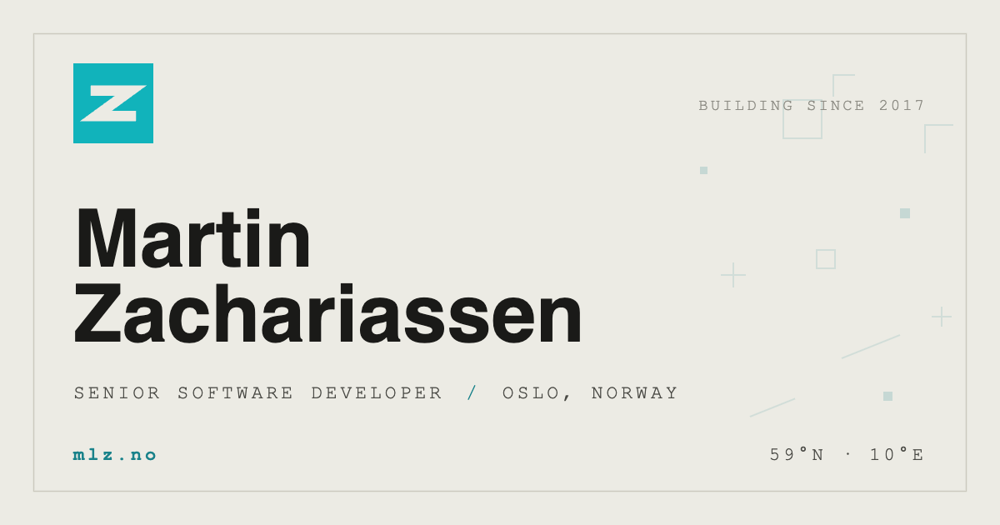

<div align="center">

# mlz.no

**The personal homepage of [Martin Zachariassen](https://mlz.no)** — a lightweight
[Vite](https://vite.dev) + [React](https://react.dev) + TypeScript app,
served by a small, hardened [Bun](https://bun.sh) + [Hono](https://hono.dev) server.

[](https://github.com/martinzachariassen/mlz-no/actions/workflows/ci.yml)
[](https://github.com/martinzachariassen/mlz-no/actions/workflows/codeql.yml)
[](https://scorecard.dev/viewer/?uri=github.com/martinzachariassen/mlz-no)
[](LICENSE)
[](https://vite.dev)
[](https://react.dev)
[](https://bun.sh)
[](https://hono.dev)
[](https://www.typescriptlang.org)
[](https://railway.app)

[**Live site**](https://mlz.no) · [Quick start](#quick-start) · [Tech stack](#tech-stack) · [Hardening](#security--hardening) · [Deployment](#deployment) · [Configuration](#configuration)

<a href="https://mlz.no">
  
</a>

</div>

## About

A single-page, editorial monospace landing page on a paper background. The
frontend is a small [Vite](https://vite.dev) + [React](https://react.dev) +
TypeScript app — composed from a handful of focused components and a single
`profile` data source — built to static assets and served by a ~100-line
TypeScript server that exists for one reason: to stay up and stay safe without a
heavy framework in front of it.

- **Lightweight component UI** — React + TypeScript, one component per section,
  all page content driven from `src/data/profile.ts`.
- **Hardened by default** — strict CSP, rate limiting, method allowlist, and
  traversal-safe static serving on every response. The build ships no inline
  scripts or styles, so `script-src` / `style-src` stay free of `unsafe-inline`.
- **Editorial typography** — Space Mono + Architects Daughter, with alternate
  name treatments one attribute away ([design knobs](#design-knobs)).
- **Respectful motion & analytics** — CSS-animated marks that honour
  `prefers-reduced-motion`; cookieless, privacy-first [Umami](https://umami.is)
  analytics.
- **Boring, verifiable CI** — every push lints, type-checks, builds, then boots
  the real server and asserts the hardening still holds.

## Quick start

> [Bun](https://bun.sh) is pinned in `mise.toml` — [mise](https://mise.jdx.dev)
> installs the right version for you.

```bash
git clone https://github.com/martinzachariassen/mlz-no.git
cd mlz-no
mise install     # installs the pinned Bun
bun install      # installs React, Vite, Hono + middleware
mise run dev     # Vite dev server with HMR on http://127.0.0.1:4173
```

All day-to-day tasks live in `mise.toml`:

| Task                 | What it does                                          |
| -------------------- | ----------------------------------------------------- |
| `mise run dev`       | Vite dev server with HMR on port `4173`               |
| `mise run build`     | Build the production bundle into `dist/`              |
| `mise run preview`   | Preview the production build with Vite               |
| `mise run start`     | Serve `dist/` via the Bun + Hono server              |
| `mise run typecheck` | Type-check the app and server (`tsc --noEmit`)        |
| `mise run lint`      | Lint + format check with Biome (read-only)            |
| `mise run format`    | Format and auto-fix with Biome                        |

## Tech stack

| Layer     | Choice                                                          |
| --------- | --------------------------------------------------------------- |
| Runtime   | [Bun](https://bun.sh) — pinned via `mise.toml`                  |
| Frontend  | [React](https://react.dev) 19 + TypeScript                     |
| Build     | [Vite](https://vite.dev) 7                                      |
| Server    | [Hono](https://hono.dev) + first-party middleware, TypeScript   |
| Tooling   | [Biome](https://biomejs.dev) for lint + format                  |
| Hosting   | [Railway](https://railway.app) — auto-deploy from `main`        |
| Analytics | [Umami](https://umami.is) — cookieless, privacy-first           |

## Project structure

```text
index.html              # Vite entry — head metadata, JSON-LD, design knobs on <html>
src/
├── main.tsx            #   React entry — mounts <App> into #root
├── App.tsx             #   composition root
├── components/         #   one component per section of the page
│   ├── Hero.tsx        #     the page shell (topbar + identity + footer + marks)
│   ├── TopBar.tsx      #     brand + "building since" strip
│   ├── Identity.tsx    #     name, role, and the contact links
│   ├── ContactLinks.tsx#     the GitHub / LinkedIn / Email buttons
│   ├── Footer.tsx      #     copyright + coordinates
│   ├── FloatingMarks.tsx#    the drifting decorative background
│   └── icons/          #     inline SVG icon components
├── data/
│   ├── profile.ts      #     all page copy + contact links (single source of truth)
│   └── marks.ts        #     ordered shape list for the background marks
└── styles/             #   global CSS, split by concern
    ├── index.css       #     imports the rest in cascade order
    ├── tokens.css      #     design tokens + accent palettes
    ├── base.css        #     reset, hero shell, reveal animations
    ├── marks.css       #     background marks
    ├── layout.css      #     topbar / identity / footer + responsive
    └── contact.css     #     contact link buttons
public/                 # copied verbatim to the dist root by Vite
├── robots.txt          #   crawler directives (well-known root path)
├── sitemap.xml         #   single-URL sitemap (well-known root path)
├── favicon.ico         #   legacy favicon (browsers auto-fetch /favicon.ico)
├── site.webmanifest    #   PWA manifest
└── assets/
    ├── icons/          #   favicon.svg, favicon-32/192.png, apple-touch-icon.png
    └── social/         #   og.png, twitter-card.png
server/index.ts         # Bun + Hono server: serves dist/, hardened against abuse
vite.config.ts          # Vite config (React plugin, CSP-safe build settings)
railway.json            # Railway config-as-code (healthcheck path)
mise.toml               # pins Bun, defines the dev / build / start / lint tasks
```

`robots.txt`, `sitemap.xml`, and `favicon.ico` stay at the `public/` root on
purpose — crawlers and browsers request them at fixed, well-known paths — and
`site.webmanifest` is conventionally root-served. Vite copies `public/` to the
`dist/` root untouched, so those URLs are preserved.

## Security & hardening

The server ([`server/index.ts`](server/index.ts)) leans on well-maintained,
mostly first-party middleware rather than hand-rolled code. Each threat maps to
one deliberate defence:

| Threat                        | Defence                                                                                                        |
| ----------------------------- | -------------------------------------------------------------------------------------------------------------- |
| XSS / content injection       | CSP scoped to exactly what the page loads (bundled JS/CSS from self, Google Fonts, Umami), via `hono/secure-headers`; the Vite build ships no inline scripts or styles |
| Clickjacking, sniffing, leaks | `X-Frame-Options: DENY`, `nosniff`, HSTS, `Referrer-Policy`, `Permissions-Policy` on every response             |
| Request floods (L7)           | Per-client rate limiting (`hono-rate-limiter`), fixed window keyed on the left-most `X-Forwarded-For` entry     |
| Path traversal                | `serveStatic` resolves strictly within `dist/` — blocked by construction                                        |
| Method abuse                  | `GET`/`HEAD` allowlist; everything else gets a `405`                                                            |
| Slowloris / oversized bodies  | 30 s `idleTimeout` and a 16 KiB request-body cap                                                                |
| Crashes on malformed input    | Central `onError` turns any thrown handler into a generic `500` — nothing leaks, the process stays up           |
| Broken deploys                | Railway only shifts traffic once `/health` returns `200`; the route sits *before* the rate limiter so a flood can't fake an unhealthy probe |

> [!IMPORTANT]
> A true volumetric DDoS must be absorbed at the **edge**, not in the app.
> Front the Railway domain with Cloudflare (free tier, proxied DNS record) for
> network-layer protection, WAF rules, and caching. The hardening above keeps a
> single instance healthy against application-layer abuse — it's the last line
> of defence, not a substitute for an edge.

**Verified in CI.** [`ci.yml`](.github/workflows/ci.yml) lints with Biome,
type-checks, builds, then boots the real server and asserts the contract: status
codes for `GET`/`POST`/missing/traversal paths and the presence of the key
security headers. [CodeQL](https://codeql.github.com) scans on every push and weekly;
[Dependabot](https://docs.github.com/code-security/dependabot) keeps Bun and
GitHub Actions dependencies current; and
[OpenSSF Scorecard](https://scorecard.dev) grades the repo's supply-chain
posture and publishes the score behind the badge above.

## Deployment

Every push to `main` deploys automatically to [Railway](https://railway.app).
Railway's Railpack builder detects Bun (via `package.json` + `bun.lock`), runs
`bun install`, builds the app with `bun run build`, and starts the server with
`bun run start` — which serves the generated `dist/`. The server binds to `::`
on `$PORT` so the edge can reach the container over IPv4 or IPv6.

[`railway.json`](railway.json)
([config as code](https://docs.railway.com/reference/config-as-code)) pins the
build (`bun run build`) and start (`bun run start`) commands and points the
healthcheck at `/health` — during a deploy, traffic only switches to the new
version once it returns `200`, so a broken build never takes the live site down.

Custom domains are configured under **Settings → Networking** in the Railway
dashboard; SSL is automatic.

## Configuration

### Environment variables

Sensible defaults, all optional:

| Variable               | Default | Purpose                             |
| ---------------------- | ------- | ----------------------------------- |
| `PORT`                 | `4173`  | Port the server listens on          |
| `HOST`                 | `::`    | Bind address (dual-stack)           |
| `RATE_LIMIT_MAX`       | `120`   | Requests allowed per window         |
| `RATE_LIMIT_WINDOW_MS` | `10000` | Rate-limit window length in ms      |

### Design knobs

The page sets defaults on `<html>` via data attributes that the CSS reads —
retune the look from the markup without touching a line of CSS:

| Attribute     | Default  | Options                          |
| ------------- | -------- | -------------------------------- |
| `data-font`   | `hand`   | `grotesk`, `mono`, `serif`       |
| `data-case`   | `upper`  | `title`, `lower`                 |
| `data-accent` | `cyan`   | `blue`, `green`, `rust`, `ink`   |
| `data-motion` | `subtle` | `off` (hides the drifting marks) |

## License

[MIT](LICENSE) © [Martin Zachariassen](https://mlz.no)

---

<div align="center">
<sub>Built with <a href="https://bun.sh">Bun</a> and <a href="https://hono.dev">Hono</a> · Deployed on <a href="https://railway.app">Railway</a> · <a href="https://mlz.no">mlz.no</a></sub>
</div>
