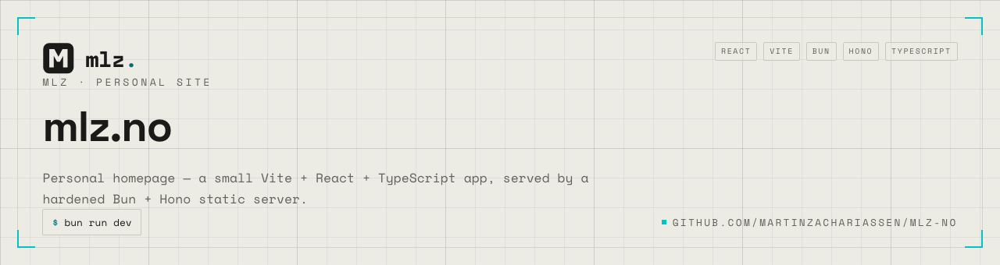
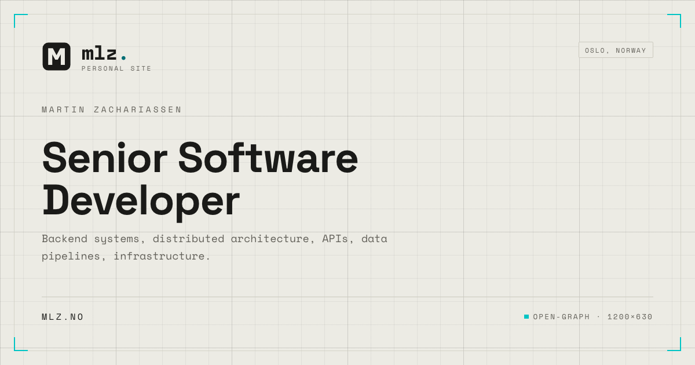

<div align="center">



<br><br>

[](https://github.com/martinzachariassen/mlz-no/actions/workflows/ci.yml)
[](https://github.com/martinzachariassen/mlz-no/actions/workflows/codeql.yml)
[](https://scorecard.dev/viewer/?uri=github.com/martinzachariassen/mlz-no)
[](LICENSE)
[](https://vite.dev)
[](https://react.dev)
[](https://www.typescriptlang.org)
[](https://workers.cloudflare.com)

[**Live site**](https://mlz.no) · [Quick start](#quick-start) · [Design system](#design-system) · [Tech stack](#tech-stack) · [Hardening](#security--hardening) · [Deployment](#deployment) · [Configuration](#configuration)

<a href="https://mlz.no">
  
</a>

</div>

## About

**The personal homepage of [Martin Zachariassen](https://mlz.no)** — a single-page,
editorial monospace landing page on a paper background. The frontend is a small
[Vite](https://vite.dev) + [React](https://react.dev) + TypeScript app — composed
from a handful of focused components, styled entirely from
[`@martinzachariassen/design`](https://github.com/martinzachariassen/mlz-design),
and driven by a single `profile` data source — built to static assets and served
straight from Cloudflare's edge, with no server process and no per-request code
anywhere in the path.

- **Design-system UI** — every visual — palette, type, motion, the brand mark
  itself — is inherited from [`@martinzachariassen/design`](#design-system)
  rather than hand-rolled per project, so this site and every other MLZ project
  share one look and move together when the system changes.
- **Lightweight component composition** — React + TypeScript, one component per
  section, all page content driven from `src/data/profile.ts`.
- **Hardened by default** — a strict CSP and the full set of security headers on
  every response, declared in [`public/_headers`](public/_headers). The build
  ships no inline `<script>`/`<style>` tags, so `script-src` / `style-src` stay
  free of `unsafe-inline` — the design system's own inline `style` props apply
  via the CSSOM on the client, which `style-src` doesn't govern.
- **Respectful motion & analytics** — the design system's drifting marks and
  glitch accents honour `prefers-reduced-motion`; cookieless, privacy-first
  [Umami](https://umami.is) analytics.
- **Boring, verifiable CI** — every push lints, type-checks, builds, then boots
  the real Workers runtime and asserts the hardening and cache policy still hold.

## Quick start

> [Bun](https://bun.sh) is pinned in `mise.toml` — [mise](https://mise.jdx.dev)
> installs the right version for you.

```bash
git clone https://github.com/martinzachariassen/mlz-no.git
cd mlz-no
mise install     # installs the pinned Bun
bun install      # installs React, Vite, and the design system
mise run dev     # Vite dev server with HMR on http://127.0.0.1:4173
```

All day-to-day tasks live in `mise.toml`:

| Task                 | What it does                                          |
| -------------------- | ----------------------------------------------------- |
| `mise run dev`       | Vite dev server with HMR on port `4173`               |
| `mise run build`     | Build the production bundle into `dist/`              |
| `mise run preview`   | Preview the production build with Vite                |
| `mise run preview:worker` | Serve `dist/` through the local Workers runtime  |
| `mise run deploy`    | Deploy `dist/` to Cloudflare Workers                  |
| `mise run typecheck` | Type-check the app and server (`tsc --noEmit`)        |
| `mise run lint`      | Lint + format check with Biome (read-only)            |
| `mise run format`    | Format and auto-fix with Biome                        |

## Tech stack

| Layer     | Choice                                                                          |
| --------- | ------------------------------------------------------------------------------- |
| Frontend  | [React](https://react.dev) 19 + TypeScript                                      |
| Build     | [Vite](https://vite.dev) 8                                                      |
| Toolchain | [Bun](https://bun.sh) — package manager and build runner, pinned via `mise.toml` |
| Tooling   | [Biome](https://biomejs.dev) for lint + format                                  |
| Hosting   | [Cloudflare Workers](https://workers.cloudflare.com) static assets — auto-deploy from `main` |
| Analytics | [Umami](https://umami.is) — cookieless, privacy-first                           |

There is no server process and no runtime dependency: `dependencies` is the
design system plus React, and Bun never runs in production — it only installs
packages and drives `vite build`.

## Design system

The look — palette, type, motion, the brand mark itself — comes from
[`@martinzachariassen/design`](https://github.com/martinzachariassen/mlz-design),
installed as a private [GitHub Packages](https://github.com/features/packages)
dependency rather than redefined in this repo. Change a token there, cut a
release, and this site (and every other MLZ project) picks it up.

**1. Point the scope at GitHub Packages** — already committed as [`.npmrc`](.npmrc):

```ini
@martinzachariassen:registry=https://npm.pkg.github.com
//npm.pkg.github.com/:_authToken=${GITHUB_TOKEN}
```

**2. Authenticate.** Every install — local or CI — needs a `GITHUB_TOKEN` with
`read:packages`, since GitHub Packages requires auth even for reading a package
you own:

- **Local:** `export GITHUB_TOKEN=$(gh auth token)` before `bun install` (uses
  the token the [GitHub CLI](https://cli.github.com) already holds from
  `gh auth login`).
- **CI** ([`ci.yml`](.github/workflows/ci.yml),
  [`lighthouse.yml`](.github/workflows/lighthouse.yml)): the workflow's
  automatic, per-run `GITHUB_TOKEN` is used directly — no secret to manage. This
  only works because the `mlz-design` package's **Manage Actions access**
  settings explicitly grant this repo Read.
- **Deploys:** [`deploy.yml`](.github/workflows/deploy.yml) builds inside
  Actions for exactly this reason — the same automatic `GITHUB_TOKEN` covers the
  install, so no long-lived PAT has to be handed to Cloudflare.

**3. Inherit it** — `src/styles/index.css` imports the package's tokens and base
layer, and `@source`s its compiled classes so Tailwind emits them:

```css
@import "tailwindcss";
@import "@martinzachariassen/design/styles/theme.css";
@import "@martinzachariassen/design/styles/base.css";
@source "../../node_modules/@martinzachariassen/design/dist";
```

(Google Fonts stays on a preconnected `<link>` in `index.html` rather than the
package's bundled `@import`, so Tailwind's layer hoisting doesn't drop it — see
[`index.html`](index.html).)

Components then import straight from the package —
`import { BrandMark, GlitchText, buttonVariants } from "@martinzachariassen/design"`
— styled with its semantic Tailwind tokens (`bg-background`, `text-foreground`,
`animate-rise`…). Retune the whole site from [`index.html`](index.html)'s
`<html>` attributes: `data-accent` (`cyan` · `blue` · `green` · `rust` · `ink`)
and a `dark` class for the ink theme.

## Project structure

```text
index.html              # Vite entry — head metadata, JSON-LD, data-accent on <html>
src/
├── main.tsx            #   React entry — mounts <App> into #root
├── App.tsx             #   composition root
├── components/         #   one component per section of the page
│   ├── Hero.tsx        #     the page shell (design system's FloatingMarks + sections)
│   ├── TopBar.tsx      #     brand lockup + "building since" strip
│   ├── Identity.tsx    #     name, role, and the contact links
│   ├── ContactLinks.tsx#     the GitHub / LinkedIn / Email buttons
│   ├── Footer.tsx      #     copyright + coordinates
│   └── icons/          #     inline SVG icon components
├── data/
│   └── profile.ts      #     all page copy + contact links (single source of truth)
└── styles/
    └── index.css       #     Tailwind + design-system imports, one `@layer base` tweak
public/                 # copied verbatim to the dist root by Vite
├── _headers            #   security headers + cache policy (read by Cloudflare)
├── robots.txt          #   crawler directives (well-known root path)
├── sitemap.xml         #   single-URL sitemap (well-known root path)
├── favicon.ico         #   legacy favicon (browsers auto-fetch /favicon.ico)
├── site.webmanifest    #   PWA manifest
└── assets/
    ├── icons/          #   favicon.svg, favicon-32/192.png, apple-touch-icon.png — the MLZ mark
    └── social/         #   og.png, twitter-card.png — built on the design system's SocialCard frame
assets/
└── banner.png          # README header banner (design system's RepoBanner, standard layout)
vite.config.ts          # Vite config (React + Tailwind v4 plugins, CSP-safe build settings)
wrangler.jsonc          # Cloudflare Workers config — static assets only, no `main`
mise.toml               # pins Bun, defines the dev / build / deploy / lint tasks
```

`robots.txt`, `sitemap.xml`, and `favicon.ico` stay at the `public/` root on
purpose — crawlers and browsers request them at fixed, well-known paths — and
`site.webmanifest` is conventionally root-served. Vite copies `public/` to the
`dist/` root untouched, so those URLs are preserved.

## Security & hardening

There is no application code on the request path, so most of the old server's
job is now either a Cloudflare platform guarantee or a line in
[`public/_headers`](public/_headers). Each threat still maps to one deliberate
defence:

| Threat                        | Defence                                                                                                        |
| ----------------------------- | -------------------------------------------------------------------------------------------------------------- |
| XSS / content injection       | CSP scoped to exactly what the page loads (bundled JS/CSS from self, Google Fonts, Umami), declared in `_headers`; the Vite build ships no inline scripts or styles |
| Clickjacking, sniffing, leaks | `X-Frame-Options: DENY`, `nosniff`, HSTS, `Referrer-Policy`, `Permissions-Policy` on every response             |
| Request floods (L7)           | Absorbed at Cloudflare's edge, where it belongs — static assets are served from cache and never reach an origin |
| Path traversal                | Only files present in the uploaded asset manifest are addressable; there is no filesystem to traverse            |
| Method abuse                  | Workers' static-asset handler answers anything other than `GET`/`HEAD` with a `405`                             |
| Config disclosure             | `_headers` configures the deployment but is never itself servable — it returns `404`                            |
| Crashes on malformed input    | No per-request code runs; there is nothing to throw and no process to take down                                 |
| Broken deploys                | Assets are uploaded before the new version is activated, so a failed deploy leaves the previous one serving      |

Two things that were previously missing entirely now come for free: responses are
compressed, and content-hashed bundles under `/bundle/` are served
`immutable`. Favicons and social cards under `/assets/` deliberately are *not*
immutable — those URLs are stable across deploys, so caching them permanently
would make them unreplaceable.

> [!NOTE]
> The rate limiter that used to run in-process is gone on purpose. It was
> per-instance, in-memory, and keyed on a spoofable `X-Forwarded-For`, so it
> never meaningfully mitigated a flood. Serving from Cloudflare's edge addresses
> the same threat at the layer that can actually absorb it. If a specific abuse
> pattern ever needs shaping, that is a WAF or Rate Limiting rule on the zone,
> not code in this repo.

**Verified in CI.** [`ci.yml`](.github/workflows/ci.yml) runs two stages: a
**build** job lints with Biome, type-checks, builds the bundle, and uploads
`dist/` as an artifact; a **smoke** job then downloads that exact artifact, boots
it under `wrangler dev` — the same `workerd` runtime Cloudflare runs in
production — and asserts the contract: status codes for
`GET`/`POST`/missing/traversal/`_headers` paths, the presence of every security
header, that hashed bundles are compressed and immutably cacheable, and that the
favicon is *not*. Testing the uploaded artifact means CI exercises the same
bundle that would deploy, not a rebuilt copy.
[CodeQL](https://codeql.github.com) scans on every push and weekly;
[Dependabot](https://docs.github.com/code-security/dependabot) keeps Bun and
GitHub Actions dependencies current; and
[OpenSSF Scorecard](https://scorecard.dev) grades the repo's supply-chain
posture and publishes the score behind the badge above.

## Deployment

Every push to `main` runs [`deploy.yml`](.github/workflows/deploy.yml), which
installs, builds `dist/`, and publishes it with `wrangler deploy`.

[`wrangler.jsonc`](wrangler.jsonc) declares a **static-assets-only Worker**: it
has no `main` entrypoint, so Cloudflare serves `dist/` directly from the edge and
no JavaScript executes per request. `not_found_handling` is left at `none` — this
site has no client-side router, so an unknown path must stay a real `404` rather
than rewriting to `index.html` and reporting a soft `200` to crawlers.

The deploy runs from GitHub Actions rather than Cloudflare's own Git integration
because the build needs a GitHub Packages token to install the
[design system](#design-system); Actions supplies one per run, so no long-lived
PAT has to live in Cloudflare. It needs two repository secrets:

| Secret                  | Where to get it                                                        |
| ----------------------- | ---------------------------------------------------------------------- |
| `CLOUDFLARE_API_TOKEN`  | Cloudflare dashboard → My Profile → API Tokens → *Edit Cloudflare Workers* |
| `CLOUDFLARE_ACCOUNT_ID` | Cloudflare dashboard → Workers & Pages → Account ID                     |

**Custom domain.** The first deploy publishes to `mlz-no.<subdomain>.workers.dev`.
To serve `mlz.no`, add it under **Workers & Pages → mlz-no → Settings → Domains
& Routes** (the zone must be on the same account); SSL is automatic. To keep that
binding in version control instead, uncomment the `routes` block in
[`wrangler.jsonc`](wrangler.jsonc).

## Configuration

No runtime environment variables exist — there is no runtime. What used to be
`PORT`, `HOST`, and the rate-limit knobs is now either irrelevant or a Cloudflare
zone setting.

Deploy-time configuration lives in two files:

| File                                   | Controls                                              |
| -------------------------------------- | ----------------------------------------------------- |
| [`wrangler.jsonc`](wrangler.jsonc)     | Worker name, asset directory, 404 handling, routes    |
| [`public/_headers`](public/_headers)   | Security headers and cache policy per path            |

Retuning the visual theme is a [design system](#design-system) concern — see
that section for the `data-accent` / dark-mode knobs on `<html>`.

## License

[MIT](LICENSE) © [Martin Zachariassen](https://mlz.no)

---

<div align="center">
<sub>Built with <a href="https://react.dev">React</a> and <a href="https://vite.dev">Vite</a> · Deployed on <a href="https://workers.cloudflare.com">Cloudflare Workers</a> · <a href="https://mlz.no">mlz.no</a></sub>
</div>
