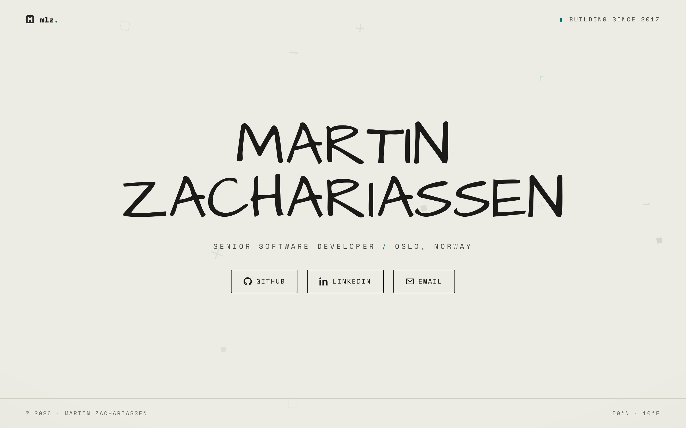
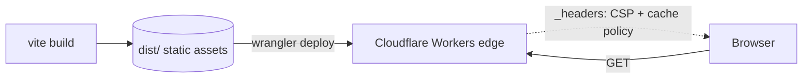

# mlz-no

Personal homepage for Martin Zachariassen — a Vite + React app served as static assets from Cloudflare Workers.

[](https://github.com/martinzachariassen/mlz-no/actions/workflows/ci.yml)
[](https://scorecard.dev/viewer/?uri=github.com/martinzachariassen/mlz-no)
[](LICENSE)



**Status:** Live in production at [mlz.no](https://mlz.no).

## What it does

- A single-page editorial homepage: name, role, and contact links, with all page copy driven from one file (`src/data/profile.ts`).
- Ships as a **static-assets-only Cloudflare Worker** — there is no `main` entrypoint and no per-request code, so the site is served from the edge with nothing to execute. Every response carries a strict CSP and the full security-header set, declared once in [`public/_headers`](public/_headers) rather than applied by middleware. The Vite build emits no inline `<script>`/`<style>`, so `script-src`/`style-src` stay free of `unsafe-inline`.
- Every visual — palette, type, motion, the brand mark — is inherited from the private [`@martinzachariassen/design`](https://github.com/martinzachariassen/mlz-design) system, so this site and every other MLZ project share one look and update together.
- It does **not** run a server, use runtime environment variables, or rate-limit in process (floods are absorbed at Cloudflare's edge), and it has no client-side router — an unknown path returns a real `404` with a custom HTML error page ([`404.html`](404.html)), never a soft `200`.

## Quickstart

Requires [mise](https://mise.jdx.dev) and an authenticated [GitHub CLI](https://cli.github.com) — the design system is a private GitHub Packages dependency, so `bun install` needs a token with `read:packages`.

```bash
git clone https://github.com/martinzachariassen/mlz-no.git
cd mlz-no
mise install                          # installs the pinned Bun
export GITHUB_TOKEN=$(gh auth token)  # auth for the private design system
bun install                           # React, Vite, and the design system
mise run dev                          # serves http://127.0.0.1:4173 with HMR
```

## Configuration

There are no runtime environment variables — nothing executes per request. What remains is build-time and deploy-time.

| Variable                | Used by              | Required | Description                                                                                                           |
| ----------------------- | -------------------- | -------- | --------------------------------------------------------------------------------------------------------------------- |
| `GITHUB_TOKEN`          | install (local + CI) | yes      | `read:packages` scope; pulls `@martinzachariassen/design` from GitHub Packages. Locally, `gh auth token` supplies it. |
| `CLOUDFLARE_API_TOKEN`  | deploy (repo secret) | yes      | Token from the "Edit Cloudflare Workers" template.                                                                    |
| `CLOUDFLARE_ACCOUNT_ID` | deploy (repo secret) | yes      | The account the Worker lives in.                                                                                      |

Deploy-time behaviour lives in two files: [`wrangler.jsonc`](wrangler.jsonc) (Worker name, asset directory, 404 handling, routes) and [`public/_headers`](public/_headers) (security headers and cache policy per path).

The visual theme is the reader's: a `ThemeToggle` (light · dark · system) and an `AccentPicker` (`cyan` · `blue` · `green` · `rust` · `ink`) persist their choice to `localStorage` under `mlz-theme` and `mlz-accent`, and the design system applies it as a `dark` class and a `data-accent` attribute on `<html>`. The markup in [`index.html`](index.html) only carries the no-JS default. Because `script-src` is `'self'`, the pre-paint bootstrap that prevents a flash of the wrong theme cannot be inlined — [`vite/theme-init.ts`](vite/theme-init.ts) emits it as a hashed same-origin script instead.

Fonts are self-hosted: Space Grotesk and Space Mono ship inside the design system, Architects Daughter comes from Fontsource, and all of them are fingerprinted into `/bundle/`. Nothing is fetched from a third-party origin, which is why `font-src` and `style-src` are both `'self'`.

## Architecture

Vite builds the React + TypeScript app and the design system's tokens into `dist/`, which `wrangler deploy` uploads to Cloudflare Workers as static assets. The one thing to get right: there is no server. The Worker has no `main`, so no JavaScript runs per request — hardening and caching are configuration ([`public/_headers`](public/_headers)), not code. Content-hashed bundles under `/bundle/` are served `immutable`; stable-URL favicons and social cards under `/assets/` are not. Those favicons and social cards are committed output — the design system's generator that produced them was removed in v0.4.0, so they are now maintained by hand.


```mermaid
flowchart LR
  Vite[vite build] --> Dist[(dist/ static assets)]
  Dist -->|wrangler deploy| Edge[Cloudflare Workers edge]
  Browser -->|GET| Edge
  Edge -.->|_headers: CSP + cache policy| Browser
```

## Development

```bash
mise install                          # pinned Bun
export GITHUB_TOKEN=$(gh auth token)
bun install
mise run lint                         # Biome lint + format check
mise run typecheck                    # tsc --noEmit (app + build config)
mise run build                        # production bundle -> dist/
```

| Task                      | What it does                                                         |
| ------------------------- | -------------------------------------------------------------------- |
| `mise run dev`            | Vite dev server with HMR on port `4173`                              |
| `mise run build`          | Build the production bundle into `dist/`                             |
| `mise run preview`        | Preview the production build with Vite                               |
| `mise run preview:worker` | Serve `dist/` through the local Workers runtime (applies `_headers`) |
| `mise run deploy`         | Deploy `dist/` to Cloudflare Workers                                 |
| `mise run typecheck`      | Type-check the app and build config (`tsc --noEmit`)                 |
| `mise run lint`           | Lint + format check with Biome (read-only)                           |
| `mise run format`         | Format and auto-fix with Biome                                       |

On every push, [`ci.yml`](.github/workflows/ci.yml) lints, type-checks, and builds, then boots the built `dist/` under the real Workers runtime (`wrangler dev`) and asserts that status codes, every security header, and the cache policy still hold. [CodeQL](https://codeql.github.com), [Dependabot](https://docs.github.com/code-security/dependabot), and [OpenSSF Scorecard](https://scorecard.dev) run on separate schedules.

## Deployment

Every push to `main` runs [`deploy.yml`](.github/workflows/deploy.yml): install, `mise run build`, `wrangler deploy`. The deploy runs from GitHub Actions rather than Cloudflare's Git integration because the build needs a GitHub Packages token for the design system, and Actions supplies one (`GITHUB_TOKEN`) per run — so no long-lived PAT lives in Cloudflare. It needs the two repository secrets above.

The first deploy publishes to `mlz-no.<subdomain>.workers.dev`. To serve `mlz.no`, bind it under **Workers & Pages → mlz-no → Settings → Domains & Routes** (the zone must be on the same account), or uncomment the `routes` block in [`wrangler.jsonc`](wrangler.jsonc). Rollback: redeploy the previous commit on `main`.

## Contributing

This is my personal homepage, so I probably won't take feature PRs — but issues and fixes are welcome. Run `mise run lint && mise run typecheck` before opening one.

## License

[MIT](LICENSE) © [Martin Zachariassen](https://mlz.no)
